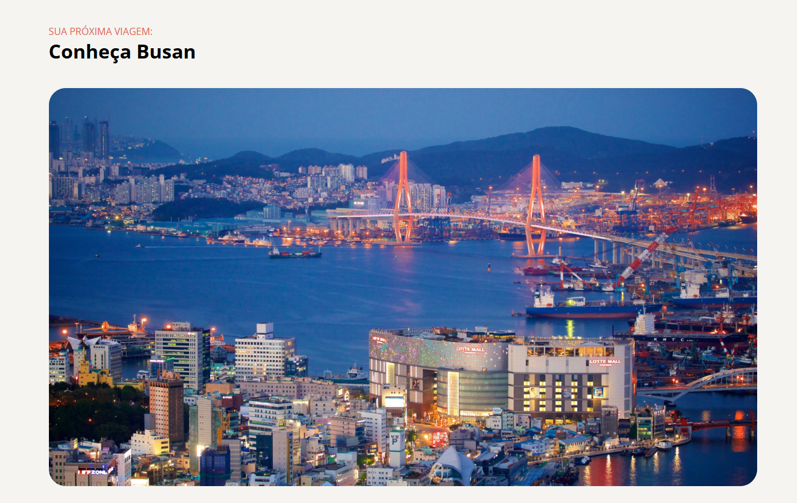

# Local Turístico: Conheça Busan

> Formação Full-Stack: Iniciando o HTML e CSS (desafio prático)

O projeto é uma simples página de turismo que exibe três destinos imperdíveis em Busan, Coreia do Sul.

[🔗 Clique aqui para acessar](https://natanjalmeida99.github.io/tourist-place/)

## 🛠️ Tecnologias

- HTML
- CSS
- Git e Github

## 💚 Contato

natanalmeida158@hotmail.com

---

Feito com ♥ by Rocketseat :wave: [Participe da nossa comunidade!](https://discord.gg/rocketseat)
